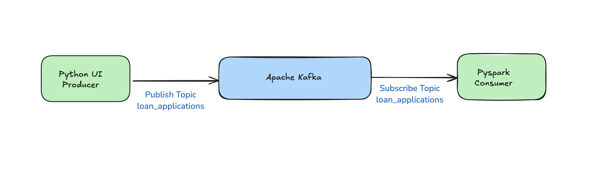

# 📈 Finance Use Case: Real-Time Loan Monitoring with Kafka  

## Overview  
This project demonstrates how a bank can use **Apache Kafka** to process loan applications in **real-time**, enabling quick decision-making for loan approvals or rejections. The system enhances the efficiency and reliability of loan processing, providing a scalable solution for handling high data volumes.

---

## 📝 Scenario  
A bank aims to process loan applications in **real-time** to provide instant decisions: **approved** or **rejected**. By leveraging **Apache Kafka**, the bank can ensure high-performance, fault-tolerant data streaming and processing.

---

## 🔄 Workflow  



### 1️⃣ **Producer: Sending Loan Application Data**  
- **Role**:  
  The banking application sends customer data (e.g., income, credit score, loan amount) to a Kafka topic named `"loan_applications"`.  

---

### 2️⃣ **Broker: Managing Data Flow**  
- **Kafka's Responsibilities**:  
  - Divides the `"loan_applications"` topic into partitions (e.g., by region) for parallel processing.  
  - Ensures high availability with data replication, even in case of server failure.  
  - Retains data for a specified duration for potential reprocessing.  
- **Benefits**:  
  Kafka guarantees **data reliability** and enables **parallel processing**, resulting in faster decisions.

---

### 3️⃣ **Consumer: Loan Decision Prediction**  
- **Consumer's Role**:  
  - Reads loan application data from the Kafka topic.  
  - Uses a **machine learning model** to analyze features like income and credit score to decide:  
    - ✅ **Approved**: High credit score and sufficient income.  
    - ❌ **Rejected**: Low credit score or excessive loan amount.  
- **Output**:  
  For this project, the results are displayed in a Jupyter Notebook console for simplicity.  

---

## Features  
- Real-time data processing using **Apache Kafka**.  
- Reliable and scalable data streaming with **partitioning** and **replication**.  
- Machine learning integration for automated loan decision-making.  

---

## Technologies Used  
- **Apache Kafka**: For real-time data streaming.  
- **Python**: For building producers and consumers.  
- **Jupyter Notebook**: For demonstrating the consumer workflow and ML decision logic.  

---

## Getting Started  
1. Clone this repository:  
   ```bash
   git clone https://github.com/dwiknrd/spark_kafka_integration.git
   ```  
2. Install dependencies:  
   ```bash
   pip install -r requirements.txt
   ```  
3. Start Kafka brokers and create the required topics.  
4. Run the producer script to simulate loan applications.  
5. Start the consumer to process and display loan decisions.

---

## Contributing  
Feel free to fork this repository and submit pull requests. Contributions are welcome!

---

## License  
This project is licensed under the [MIT License](LICENSE).